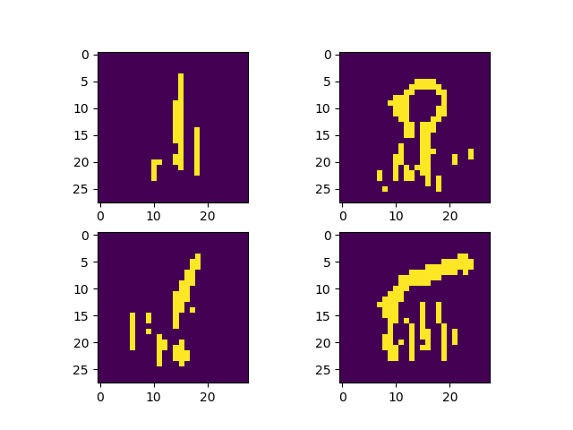
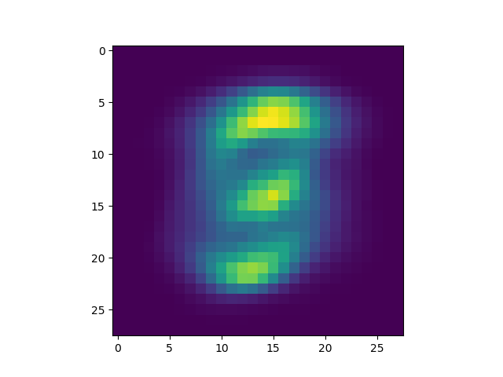
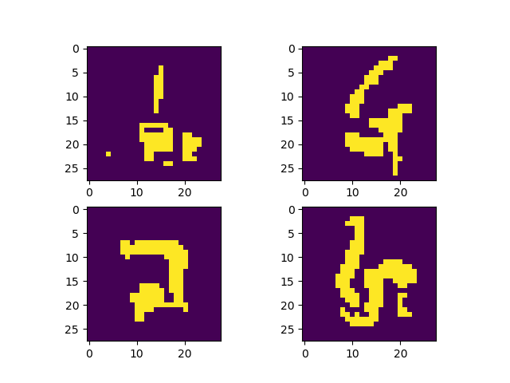
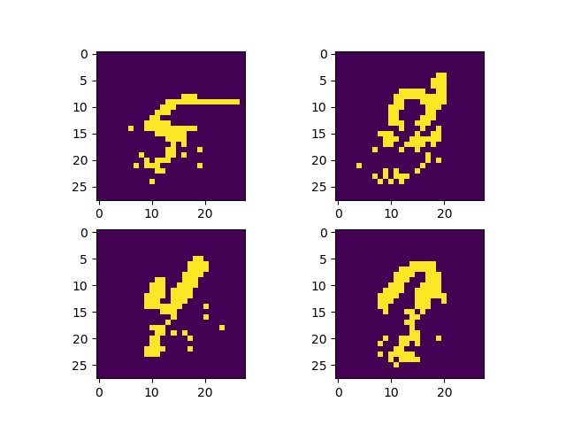

#Fill lower halves of MNIST digit images
The three approaches are:
1. Inhomogeneous Markov Chain along the columns.
2. Tabular DAG. The element (i,j) depends on (i-2,j-2), (i-2,j-1), (i-2,j), (i-1,j-2), (i-1,j-1), (i-1,j), (i,j-2), (i,j-1) elements.
3. Sigmoid Belief Network. (i,j)-th element depends on all the previous elements.

##Results
1. Inhomogeneous Markov Chain:

2. Tabular DAG:

3. Sigmoid Belief Network:

