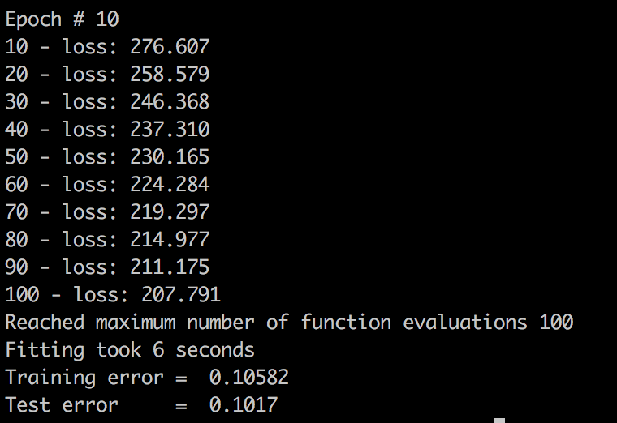

# Neural Net Implementation

## Task 2.1 (python main.py -t 2.1 )
If a neural network with sigmoid activations and one hidden layer is given with

Then this calculates 

## Task 2.2
This uses [the MNIST handwritten digits data file](http://deeplearning.net/data/mnist/mnist.pkl.gz) 
If `python main.py -t 2` is run, this will train a manually implemented one-hidden-layer neural network on the dataset. 
With `sgd=0`, this will do normal gradient descent (100 iterations).

With `sgd=1`, this will use a random minibatch size of 1% of the whole data set at a time and do 10 epochs of gradient descent with a constant learning rate of .

