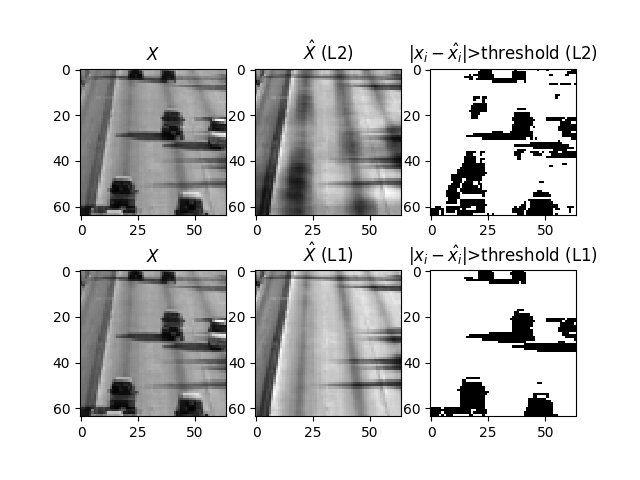
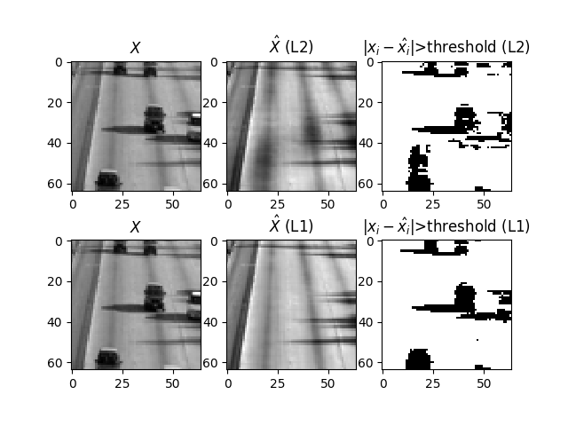
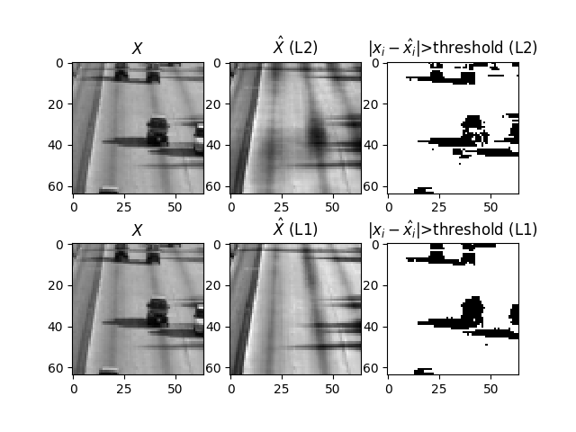
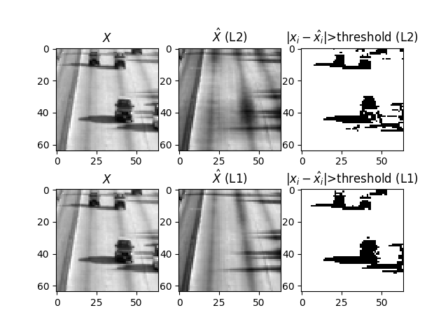
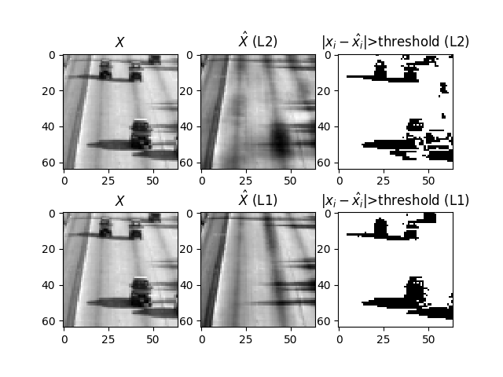
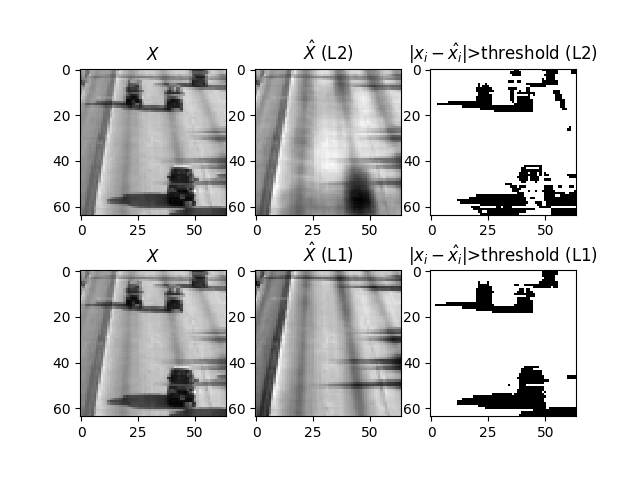
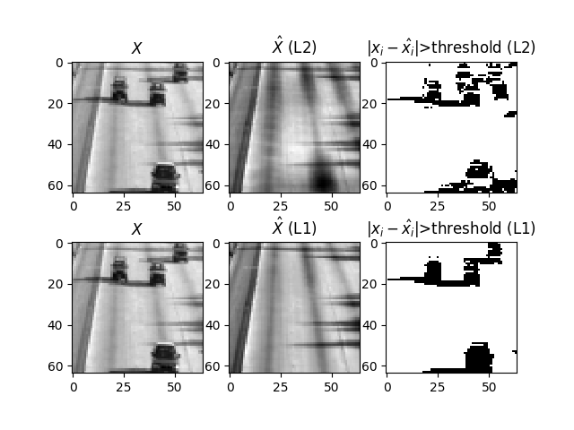
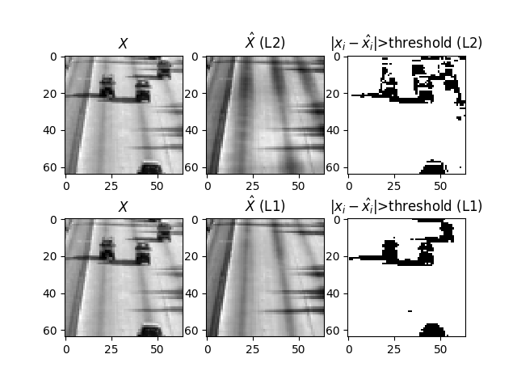
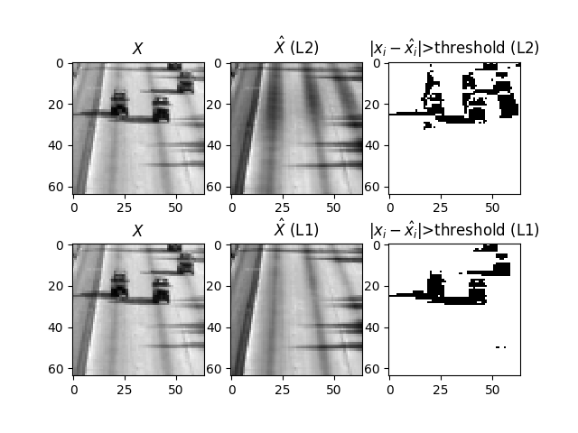
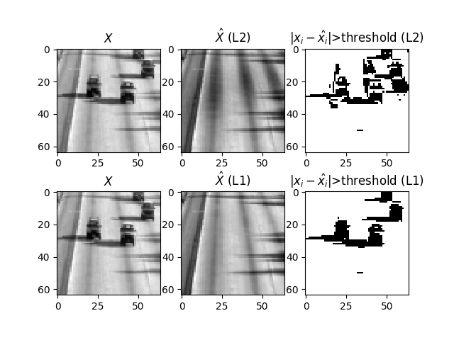

# Robust PCA Implementation

## Task 1 `(python main.py -t 1 )`
This will run a robust PCA (L1-norm) and perform background reconstruction as well as detection of cars.
The summary of the implementation is .

Results:

One can see that the robust PCA (L1-norm) does a better job than L2-norm (figures in the upper rows)
